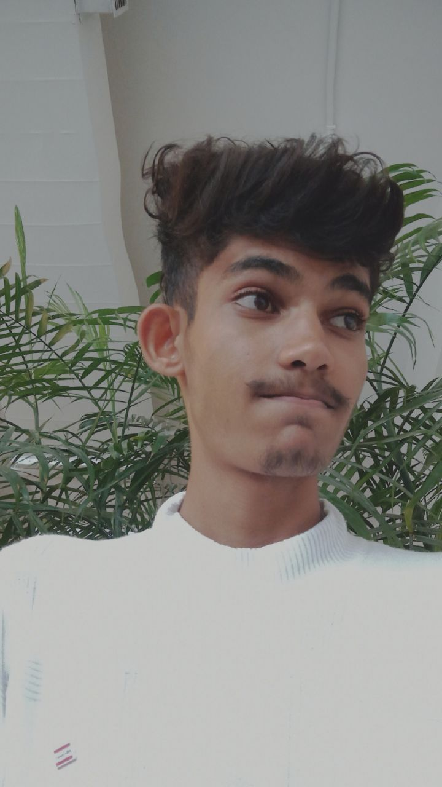

<html lang="en">
<head>
    <meta charset="UTF-8">
    <meta name="viewport" content="width=device-width, initial-scale=1.0">
    <title>Our Love Story</title>
    <link rel="stylesheet" href="https://maxcdn.bootstrapcdn.com/bootstrap/4.5.2/css/bootstrap.min.css">
    
</head>
<body>

    

        <h2 class="banner-title">Our Love Story To End Story!</h2>
        

            
            
        

        

            
Join us on a journey through our beautiful memories! ❤️✨

        

    

    

        <!-- Chapter 1 -->
        

           
            
Next Page ➔

        

        <!-- Chapter 2 -->
        

            

            

A few months ago, I went on a trip. When I returned home after a few days, I found out that a cute little baby was born at my neighbor's house. So, I went to play with the baby. As I was playing, I saw an angelic girl, sitting outside in a blue nightdress. She looked like she had come straight from heaven! 🌸👼💙

            
I met my sister and then played with the cute baby, but my mind was stuck on that beautiful girl in the nightdress, thinking, "Who is she? Where did she come from? What does she do?" 💭👗🌟

            
Everyone was talking, and soon it was time to sleep. That night, I kept thinking about that cute girl, wondering, "Who is this princess?" 🌙💤👑

            
The next day, I went back to play with the baby, but unfortunately, they were all asleep. So, I went home, but as I was leaving, the angelic girl opened the door again, still wearing the nightdress. I remember it clearly. 🏡🚪💙

            
Later in the evening, I went to sit at their house, and I was a bit nervous to talk to her for the first time, worried that she might misunderstand me. 🫣💬

            
Later, she and my sister came over to my house. My mom and sister were in another room, and it was just me and this beautiful angel alone in my room. 😳🏠👼

            
I tried to strike up a conversation by asking her about her studies. I only asked one question, but her eyes and face reaction melted me. Her beauty was stunning, but I doubted if she had a boyfriend or an ex. I slowly started building a bond by talking to her as a stranger. 💬🧐❓

            
We were both shy, but we started chatting little by little. Then, one evening, she told me she had 38k followers on Instagram. I was shocked and said, "What the heck!" 🤯📱

            
She showed me her Instagram, and I got her ID. I started thinking about how I could build a bond with her, even though I had never been interested in any other girl before. But somehow, I was drawn to this heavenly angel. 😇💖

            
I asked her directly if she had any male friends, and she said no. I thought she might be lying but didn’t press further. 🤔❌👦

            
The next day was Monday, and I had planned to go to the Mahadev temple. I wanted to build a bond with her, so I asked her if she wanted to come with me. Everyone trusted me that I wouldn’t do anything wrong, so she said yes. 🙏💫🛕

            
The next day, my little sister, the angelic girl, and I went to the Shiva temple. While there, I prayed, asking God to help me take this relationship forward. 🌿💖🙏

            
Afterwards, I randomly checked her phone and saw no boys in her chat list, except one, who was her distant cousin. I wasn’t pleased, but I couldn’t say anything either. 📱🤨

            
Later, I started talking to her on Instagram. We began sending each other Reels, and slowly, I developed a crush on her. Sadly, she didn’t feel the same about me because I’m not that good-looking. 😞📲💘

            
She didn’t have any romantic feelings for me, but I kept giving her subtle hints. She understood, and I became very important to her, too. But my feelings were one-sided. 💔🥲

            
Her presence made my life better. My exam results improved after she came into my life, and I solved many problems thanks to her. 📚🌟

            
One day, she failed one of her exams, and on that same day, she made Maggi for us. We were eating, and she started crying while eating the Maggi. 🍜😢

            
I loved her so much that I couldn’t bear to see tears in her eyes. I gave her my handkerchief, but couldn’t do much since our families were around. 😥💔

            
I comforted her, telling her that failing one exam wasn’t a big deal. Later, we chatted on Instagram, where I assured her again. She told me that she’s very sensitive and cries easily. 💬💧

            
One day, we went out together, just the two of us, and coincidentally, we wore matching clothes. As I spent time with her, I realized she was perfect for me. But I kept wondering if I was perfect for her. 💞👗👕👫

            
Her family came and took her home. After that, I missed her a lot. I even went to the bus stop to see her off. We shared our last handshake, and she gave me a smile that felt like it was just for me. 🚌👋😊

            
We continued talking on Instagram. One day, she asked if we could have a video call. I still remember what she wore during the call. Our relationship had grown from being strangers to best friends. 📱👗👫💬

           
<h2>CHAPTER 1 END</h2>

            
← Previous Page

            
Next Chapter ➔

        

        <!-- Chapter 3 -->
        

            

            
Then something happened that we used to talk all night. Once I mistakenly said something wrong to her in a joking manner. 😔 For that, I still sincerely apologize. I sent her over 1000+ messages asking for forgiveness, knowing it was my mistake and that I shouldn’t have said that. I said sorry again! 🙇‍♂️ After two days, she forgave me with a big heart, and for that, I thank my cute little angel from heaven. 🧚‍♀️ Then I asked her if we should start Snap streaks. She said she doesn’t use Snap, so I said I have another ID, would you start streaks with me? 📸 She agreed, saying, "Yes, give me the ID." So I gave her my other ID. On June 17, 2024, we started our Snap streak. 💫

            
We had a best-friend bond; she used to send me snaps daily. She did everything for me; she was everything to me, and she always will be. 💖 But when she would even look at or talk to other boys, I couldn’t stand it. I used to get angry. 😤 When I told her this, she said, "Don’t control me. I can talk to whoever I want; what’s it to you?" 🗣️ That hurt me badly. 💔 But soon, she understood from my side and said, "Okay, I won’t look at or talk to any boy except you." ✨ And just like that, our bond slowly grew.

            
I was her best friend, but the bond became something more—neither friends, nor best friends, not even girlfriend-boyfriend. 🤷‍♂️ We didn’t know what we were, but whatever it was, it was on another level! 💫 Then one night, I proposed to her because I loved her. 😍 But she didn’t have the same feelings at the time, so she didn’t accept it. 😔 But she didn’t reject it either; she said she needed time to think. I agreed. 🕰️

            
A few days later, she gave it some thought and said, "No, I reject it." 😞 That hurt me a lot, but she explained her feelings to me. Even though she tried to make me understand, I wasn’t ready to give up because I didn’t like any other girl. 💔 And I thought, “We get one life, and if I don’t find the girl I love, then how will life be?” 🥺

            
Slowly, our bond grew even stronger, and eventually, she started developing feelings of love too. 💕 Finally, we became one! 🌟 She was everything to me, and obviously, I was everything to her. 😇

            
There were small fights here and there, but both of us would let go of our ego and apologize, ending the fight, and making sure those mistakes didn’t happen again. 🤝 The first girl to come into my life was an angel from heaven, and maybe she will always remain the only one. 🧚‍♀️ That’s why I put my self-respect in front of her, because I loved her. 💖

            
But maybe she didn’t give up her self-respect for me because she never trusted that I would never disrespect her. 💔 Even to this day, she doesn’t fully trust me that I’ll never let her down. 😓 But she was afraid of losing me, and I was afraid of losing her too. So our bond was strong and solid! 💪 And it remained strong, thanks to my cute princess, my fairy. 👑✨

            
<h2>CHAPTER 2 END</h2>

            
← Previous Chapter1

            
Next Chapter ➔

        

        

            

 
            
Chapter 3 begins here, with more beautiful memories to share! 🌸💖

            
← Previous Chapter

            
Next Chapter ➔

        

        

            

            
Then came Chapter 3, where many fights and arguments happened! 😔 She used to do things that would make me upset or angry because her "girl ego" had taken over. She had this attitude of "I’m a girl, I won’t say sorry, I won’t do this, I won’t do that," and so on. Her ego and attitude became more important, and she stopped apologizing. If I said something, only then would she respond. After every fight, we would decide to start fresh the next morning, promising to forget everything and not repeat the mistakes. But she had such anger issues that, in her anger, she would leave me alone and cry herself, because she was very sensitive too. 😥 But no matter what, she was still mine, so I would forgive her, and she would forgive me too.

            
Then one day, her brother saw our chats. He saw the love hearts and the reels I sent her. He told her to end all this right there. Despite that, my cute princess didn’t change. She said, "I’m still yours; I won’t change!" 💖 That made me feel like she was my permanent partner. I said, "Fine, we’ll convince our families, just be by my side." And she replied, "Of course!!" 😊

            
I made a lot of mistakes, and she made some too. But I used to cry before God, asking Him, "Please make this girl mine, please, please, please!" 🙏 I think she also prayed to God for me because we both dreamed of being together. I had so many dreams—to go to Haridwar with her, Kedarnath, Prem Mandir, Gokul, Vrindavan, Rajasthan, Adiyogi—all these places to visit with her, to give her the princess treatment. That’s all I ever wanted. I never thought anything wrong about her, not even in my dreams, because she was my permanent choice, and I can never forget her. 🌸

         
<h2>CHAPTER 3 END</h2>

            
← Previous Chapter

            
Next Chapter ➔

        

        

            
<img src="data:image/jpeg;base64,/9j/4AAQSkZJRgABAQAAAQABAAD/2wCEAAkGBxAQDxAPDw8PDw8PDQ0NDw8PDw8ODQ8NFREWFhURFRUYHSkgGBolGxUVIzEhJSkuLzouFx8zODMtNygtLisBCgoKDg0OFxAQFy0dHR0tLS0tLS0tLS0tLS0tLS0tLS0tLSstLS0tLS0tLS0tLS0tLSstLS0tLS0tLS0tLSstLf/AABEIAKgBLAMBEQACEQEDEQH/xAAcAAACAgMBAQAAAAAAAAAAAAAAAQIEAwUGBwj/xABSEAABBAECAgUHBAkQCwEAAAABAAIDBBEFEgYhBxMxQVEUIjJhcYGRCCNyoRUzQlKSsbLC0RckJjVEVGJlc4SToqOzwcNDU1VkdYKU0tPh8Bb/xAAaAQADAQEBAQAAAAAAAAAAAAAAAQIDBAUG/8QALhEAAgIBBAECBAYDAQEAAAAAAAECEQMEEiExQRNRBSJhcTJCgZHB0RQz8KEj/9oADAMBAAIRAxEAPwDw5AwQAIAYQA8KRggBoAEAMBA0iTQkzRIntU2VtDYiw2kXNTTJcSOEyBoAbSkUjKxSzaPQ9qVg0INVIhLkzsYs2dSjwbKKHDcrO7Zthx2ytK1W2a5EV3sQmcziY3NVJmcomFwVIxkiGFRkxJiFhAAgBZTECCaEUAJAAgATASYhIAEACABADCQxhADSAEACABAEwEi0ibQpZtFGZrVJvGJMRpDeMRiS3E7DC6NaWc8o0YyEzOgAQNGSMqWbQLMbMrNujRrgYiVxZlHsv1KpJHJc85pHW10jZWYdrQEY/c9DDj2wtmufGtLMJcmB0aRm0V5m4VIykU3lao5JsgmZAgKDCAoiUySKYgygAQFAgQIASAEUxCTAEACABADSGPKABADSAEANqGNGRqlmsUZGhSzaKMrEjogiwwJM6oxsyBiloHiISxK48nPmweSpJEizj9MxbVVkuI4+1J9FR7NhTbzx4rGR1RjaLzKnP3og7OaMXuOs07RtsYeRzPYuWKc5Nvo9fT6fdK5dIhqWluAyQr9VdI6MuWL+WJon1T4Kt5xyaKk8e1UnuJUWzV2StooyzLaig4rVHmzfIgmQSCRaEUCYkxESmSRQAIENACKYCQAIEJMAQAIAEANIAQMAgCSQAgBtSY0ZGpM1iZWqToiZmhI6ImaNI3gyw1I6Y9EyzkhOmU4pqmVJWrSS4tHn5ce1ld7VmmYSiRAVEKJsKowQVmdWJc0dTpFTrXsx4hTDh0GzbkPTRQYyMOcOTG9nrVxwOVRR3puTUI+TldT1TcSBH5vZz5LoyabBFbb5PXjoMKhUpUzmr1oDOGgfWuT0ILzZg9Fghy5WaC5LlWkl0ceaUI8RNTZetoqkeNqMlsqlM4WLsQLoMoFY0ikCAZBypEMiECApgJAAgAQAkxAgAQAIAEACAGkMYQA0ACQDCRRMJFoyMKlm0WWGFI6oMzsSZ0JGdiRtCVdmbKGdPBgni71UJ8UzlzrizAWeKlr2OVRUlwR8mKndRg4tMsQsPwScjRT28nacDOHWDd3c0KXzpmrk5tM9SpSska5rvRwu7Ljbj8jOjLGSpwZpdW0yDB2kZXmS0mWPLY8ePO+Wzg9aoYzjsWabi6ZrJtLk5O4zGV1Y+TizZaRqJhzW9nmSdmI8kEPggVRmwAQCJhSWgKBtEHKjNiQIRQAYTAEAGEALCLEG1FgACLASYAEAPCQDwgYYSAaABAIkEmUMIKTJtKlmiZla5SbxkZ2PSOiMyxG5I6YyTLDSpujRS2kwfFOK54NqjOLIzQ8sqZcM8pRcZOiruIVX7nRu90TjmwUKKMpbUbfRLwZIDnChxl4N9OpNNI9Fta2yOmHRuDnSHHb2Y7V06XK8TvIa6eEsGRvP0vByU3ELwebiV1zzwyeT2IfENM+NtFZ+uB/IrlyYYPlsw1WowOL2rk1GpOB5rn4XCPmMilOTNDPhXEzcNpXIWiMmmLaixbQ2osNpLCRSQiEwZAhMhoWEyaDCB0G1FhQ8JWG0NqLCgwmFCQKhYQISYDASAeEBQ9qVjSGGosqg2osKFtRYUGECBA0MFIqzI0pNFpmRrlNG0ZGeJyk6YTLkLkmjrjyXOpyMpR+XkwyZXB1EdpvmgDuUW7sUL7Na8YBWhb6K7z3oRzzHFIc9qqx4sji+Dbw3XdVsJ7DuCmbs9CeR5MavwUZrBTSONqim6c5VowllaJmwSEqE5porkpmTZmigypbJcbJPhwhFLF5MJjPgnuRMkkBiKW5EbkQcxUmDVkdidi2C6tG4ewexFhtFtRYbQ2osVCwmKhEIJaIhMQygRjCokkkAwkMllIdjBQPcTCRW4eEFKmd5wR0U3NTjFhz21Krs9XJI0ySyj75kYI83t5kj1ZVJESml0dbe6Ahs+Y1EmQDkJoAI3Hwy12W+3BVURvPLLXCVyK+3TZIttp8jY42lwEcm70XteeRacdvtBwQQpou1VnR/qPa1+94v+ph/SntFvNlwB0VN1OkLZuOgJmliMYhEgGw4zncEto/VopdI3ALdHbWIsmx5Q6Yc4hHt2Bp++OfSUSidODLuZd4N6MbGo1I7kdmGJkjpGta9j3O8x5aTy5doKah5NZ6zY9tHRnoatYx5bX/opP0pPG2+zD/Kjd7TzCjA+eaCs3DZZ54q7d+Q1sj3hg3YGQATz5LNRtnpOWyLkehfqI3SOdyqD4BspHxwtPSOJ65P8po9b6J9UrMc8RR2mNBJ8leXyADv6twDj7G5UvHJDjqccuHwc9whwtPqVp1WB0UcjYnzEzF7W7Wua0jzQTnLh3dxQluHOSx8s7qPoW1H98Uh7HTn8xDxMpa/Gl0wd0H3T+66g90x/NVrGzHJrYy6RqtP6HLc8lpjLVUeSWfJXlwl85/UxS5aAOzEoHtBVbTneZPwX2dBN4fuyp8Jv+1G0SzV4Nfc6JLEN2lTfag3Xhbc17WSFsYgY1zsg4zneMJbCvWT8HX0+g9rR5+oFx/gVg0fW8qXivyT6/0KOs9DNhjS+tYisYGRE9hgkPqDtxaT7ce1TLE64ZXrpqujzS3XMT3RvY5kjHFj2PBa5rgcEEHsWKxy8nRDQzmt18MpSq1GjoWjjHs2HCvDsmo246kRDHPD3OkcCWxsa0kuIHuHtIVRVujPLtxxs71/QXb7rtY+1koWnpnL/kr2OM454IsaS6Fs8sMvlAlLDCX8tm3O4OAx6YScaLhkUzl1JRElMltES5OiGyDiqSIbIlMiyJKZNkcp0KxIAYKAGCkA8oAMpATBQM2nDOmm3dq1OeLFmKJxHaIy4bz7m5QkO6R9hwQtjY2NjQ1jGtYxoGGtY0YAHqwFZmaHgvicaiy28RiMVdRs0hh2/rGRhpbJ2DGQ7s9SBs1HSDpbXXdEuBvzkWqxV3OHb1UgcefjhzBj6RSY10zuHdh9iZJ570F/tRjwu2h9YP8Aipi+DTLGpHOfKOHmaf8ATt/kxpSNNOuWd90X1Op0XT2j7qqyf3zEy/nqkYzdts6SvM17dzeYJcAfY4j/AATJPmptMw8SxxYwGa/Ft+gbYc0/gkLnv5qPW/Fgv6fwfTK6DyTV8N69BqFZlquXdW/I2vG2RjwebXDJwR6iUk0+UXkxyxy2yOS1mrV0zWo9Teepit1LMMxbG94NoOjIdtYCcubnPL7j1rKcowlb8nZgxz1GJwjy4v3S4/U7HRNZguRmas8vjDzGSWSRneACRhwB7wtIzUlaOXNhnhltmqf/AHsVOJOLKWndV5bMYuu6zq8RTS7tm3d6DTj029vim5Jdkwxyne1dGo6N9TitHVLFd++GXV3vjftczc3yOsOxwBHMHtCE7FKLi6Zu+IeJaentY65N1LZXOaw9VNLucBkjDGnHvQ2l2OGOU/wqzjv/ANRS1HW9INObruoj1USfNTRbd8DNvptGfQd2eCncm1Ru8EoY5OSro7vW7xrVbFgN3mCvNMGE7Q4sYXbc92cKm6Rhjjuko+5X4W1tl+nDcjaWNmaSWE5LHtcWubnvw5p5oTtWPLjeObi/B5H0+aY2K1WtMG02YpI5cDG58W3a4+va/HsYFlk7s79Fnag4+x5O93rUWbyyns3yfdF821qDh6RFSEkc9ow+Qj1E7B/yla415PP1OTc0j2FrwSQCCWna71HAOD7iPitDlPEflIH5zTf5O9+OBRNcGuJ8ni5Kk1sRKBESU6JbEmTZByZLIlMkSYAgBpDBAEgkAIAYQM7XobZu12gPB1h3wrSlCCXR9UqiD5h0HpCu6W61DWbXcyW7PO7ro3vdvJDeRDhyw0LNyaOpY4ypnQ6T0k3tSu6fWsR1Wx/ZKpJuiZI1+5ruXMvIxzSU7dDlhjGLaPfVqchxXRJpFipp7obMToZPLLEgY4tJ2ODcHkT61MVSNc0k5cHJfKJbmPT8c/Pt/HbGpn4NtL+Y9Y0uqIK8MIADYYIoQB2AMYGj8S0OVu3ZoejPUDZ0qvMe17rOfV+uJMD4YUxdo0zQ2TaPMuK6Bj4sgcB5s13TJx6ubGn62FYyX/0PT06ctLJrwme6roPHPPOhCLbpjx3G28g9x+bjzj3rDTtuN/U9T4ttWZRXhc/fkwdNs1cQUmWHujD7byHNbvIxC7PLPZktHvCeeLkuDm0c1CbvyjcdFdVkVF7Y547DDZe8PiO5vOOM7T4Ed4RgVRDWS3TT+hxvyiG5+xv8/wD8hGZ9Guhjan+n8m0+T83Gn2R/v7j/AGESeJ2jLWRqa+x2HF/CFfVGRMsumaIXue3qXNYSXDBzlpVyimY4s0sbuJ51pPDsGm8U06tcyFjqEs5Mrg929zJ2nmAOWGhSo1I3yaiWTE1L3PUuJ4HSUbkbGl7307LGNaMuc8xOAaPWSrfRyxdNM1HRjo01LSq1ew3bOOtkkZkO2F8jnBpI7wCM+vKIqlRWWe+TkecfKH1RrpqVVrgXxRzTyj73rC1rB7fMecezxUZDbTJ8s8fAJIABcSQA0DJJPYAO8rNI3l7n1twXogoafVqct0ULetI7HTu86Q+zcXe5bo8+Tt2azo31by2G7aB3Nl1W31ZHYYGNjjjP4DGoQM88+Uj9s03+TvflQJS6Lx9njBUGrIlMTYiUyCJQIRTEIoEJMBYQIEDBAEkgBAEgEijseiGYM12gScZlmZ73wSNA+JCaE+j6sVEHjvRVwhRtxahJcqRzyR6vaga5+7LWNbGdvI+Lj8Uki3JrydDxBwnp1N+ny1qkMEztXoxtewHdguJcOZ8GlTKlQ1KTvk9BVmZS0rVYLTDJWlbKxr3Rlzc4DxjLeY9YSTT6KlFx4ZwfS1S6+3okWM79Q2n6G+Iu+oFRPtG+B1Gb+h6LOwuY5oOC5rgD4EjkVocxouBOHX6bSZUfK2YsfI4PawsGHO3YwSe8lTFUqNc2T1JbqOV4908/ZzR5wPSkhYT/ACc4d/mLHJF+pFo9n4anLRahL8qb/dP+j0tdB4JSqVa9OAMjbHXrxNJxyZGwZyXEn3kkpJKKLlKWSVvls+bOl/jRmp3miuc1KjXRQv5jrXuIMkoHgcNA9Tc96THDjk9R+T07Oky/8Qm/uok0Kbtmu+UGP2t+ldHxEP6Fhn6R3/Dn+L9DadBJHkdsN7BdHt+0xp6e9vIfE0llSXsbvpL4yfpEEMzIWT9bOYSHvMYb5hdnIB8Fs3RwQjudXR5xwbxU7VuJqlp8TYSynPBsY8yAhscrt2SB9/8AUpTtmkobYdnuGo3GwQyzvDiyGKSZwaAXFrGlxAHecBWYGWOQPaHNOWuaHNI7wRkFAHyDxbHYZqFxlqR8s7LUrJJX+lJh2Gv9QLdpAHLGMclm1ydUHxwW+jpgdrGnNeA5vlsJwezIOW/WAfciPYsjdH1lPEHscwkgPa5hLThwBGOR7itDmNbwzw7W06Dyao1zIusdJhz3SHc7GeZ9gQByHThodebTJrkjXGenH+t3B7mtaZZomuyBydyA7UmNOj5mJSNBEoJbFlMQJAJMAygQkwGkMYCAGAkBLCVjoMIsaQwEDLmk3nVrENmP04Jop2DOAXMcHYPqOMJD4Pr/AEDWYL1aK1XeHxytB5HzmO+6Y4dzgeRC0MTLpulwVhIIImxCaeSzKG58+eQ5e857zgfBA7PPONuIWT6xplKJwc2rehmncCC0WC4NazPi1pdn6Y7wVhOfzKKOjHBqEm/J6V5Qz79n4QW1nMcb0Rx7aMw/jC1+JixwP5X92dOpdzX2RsOIqPW6lpLu6GS9MfdCGj+s4LR9ozg6hL60bfX9S8lqWLWzf5PBLNs3bd+xpO3ODjOO3CpulZEI7pKPuaTo+4x+y0M0vUeTmGYRFgl67ILA4OztbjtPL1KYS3I1z4fSaV2S40hzNpcmPR1OGPPgHgn8bAiTquDt+H6hY8eog/zQf7/8zqVZ5Z8t6pr1qSV3XWJpxHM8Bk0skjPNeeW0n/2vPnubabPo4rGtsoRS+xKbS9PuSb4w6pIfOdBu3RyOxz2O8fVyWvqPxx9zR6DDlkm+G/bhft/R7V0Q1Y4tPdHE3a1tqQdna7q2ZJ8StsW6vmdnlfFNMtPlUF7X/wCs53p/i3MoHwktfkx/oSzeEafC8e/f9KM3yfz+tLmf36P7pqrEqRza+/V5PUnNB7QD7RlaHEcfrkDG65opaxrcwa0TtaG5xHBjOPb9aRSfDOg4mGaNweNK0P7JyYkaTop1TyrRqTycujh8mfk5O6FxjBPrLWtPvSQSVM8o+UDonU34rjRhlyHa845eURANyT62Fn4BUyRrjfg840fUn1bENqINMleVkzA8EsLmnIDgCCR7CFK4NHyqPQj05ar/AKnT/wChsf8AmVbjL0vqeudGHEk+p6eLdlsTZDPNHiFrmM2tIA5OcTnt71SM2qZyHyg+IJ4K8FKMRmG8ycTFzSZB1T4XN2HPLmfAoY4qz5+wpKEQmIWECBAEcJgCABAgQMkEACQDQAwkMkAkBkDEho22h63bpOLqlmauXekI34Y/6TD5rveE7opRs30/HmrTNLJdQnLSMEM6uAkeG6NrT9aUmzbHhXsU6LhkLklFHr4sCaOhgYwjsb8As/QXsbvRm20zXrlVhirWTFGXl+0RwP8APIAJy5hPcO9axcoqkyJaHDJ3KNv9f7Iatqlu41rbU5lEZcWZZEzaSOfNjRnsHahSm2rdky0WOMXsVfv/ACczqMBY05ccetxwQifEjyoY2p0U9J4quURI2pZMDZHBzw0Ru3OAwD5wPctYtro6Mkcb/ErFqnHmp2GdXLdlezc14AEbCHtOWuDmtBBB8Crt+TDbBO0jXDXLh5+V2/HPXzfpStlxjH2Riilzkk8ycnJzk+KyaO7C0Zet/wDgpo2eQ3ukcS2omdXFbnhYSXbY5XMG89/I+oKd0our4O3EsOenlgpPq2jHquqWbAAnszThhcWCWV8oaT24yeXYnGTl2xywY8d7IqP2VGmZqlmDIgs2IA52SIZpIg53Zk7SMlbRkzxdTCLlyhnirUR2alfH89sD85aps8+cIop39bt2Cw2Ldmcx7xGZp5ZSwOxu2lxOM7RnHgE7ZntRV655/wBI/wDDd+lKx7TeaBxpqWnwugp2jDE6R0rmCKCT5wta0nL2Ejk1vIHHJNSJcLMOvcW6heY2O5afOxj+sa1zY2hr8EbvNaO4n4obsSikaNIsaBGyocQXa7Orr3bkEeS7q4bM0Ue49p2tcBlO2Lj2MOparZs7TZs2LJZu2dfNJNszjO3cTjOB8EWFJdFHCCRYTEBCBESExEcJgCQCTAYQAwEgJYSGMBA0iQSHRIJFJEgUFpIyNegpGeJ6GbwZsK8uFlXJ6+naSVl+K5jvWqfB6sNRFKi9BdcVlJxIlPEzZRyOI5Z5qYSguX4OTUanDhg7Zf4X1uvUvNmu/aGwytd82ZfOIGPNAJRjyRlO/B89kl6sXtR6/qV+hXp+XyxxtrCOKXeK+52yQtDTtDc/dBdfBw8t0c7pWl6Ze06xebSpzGZ2pyRzyU4uuLRNLsOXN3AgAYz2YCEDTTMlp37F4Cf9k6aTnn9xEl4Gvxm94l1TT9NhbPcbHHE+VsLXNg6wmQtc4DDWk9jHfBN0KO59Hzbxpq8Vi/bmrEGCWbfEdhZlu0D0SAQueUU5WephyuMEmfSmrXaNGqLNlkbIgImlwh3nc7AHJoz2rodJcnmwU5yqJpeFa2mambdttavYY65sjklrN3bG14RjDxkDduWcYxdujpy5s2NRhuape/1Y+ANMNWLVKZ9GHUrHVDuFeSvE9n1OVRVWjPUZPUlGb9iXCFqKrw9VsvjyyLTI55Axrd7mtjye3tPtVdIxpylRyfTZwXVNP7J1omRSxPj67qmhjJoZHBu5zRy3Auad3hnOeWFLqy8TbltPCurWVnQ8bFux2p0RddgSCjoLTIlvgnYqIkJkggVjylQAgBJioRQISZJEpiEgBFMBZQAwUASylQDBSHYZQOxgoHY8pDTJtKC0Z4ymbwlRegWMzqjqKNhXhyueeRoUtWl5N7p1MdpXLKU58I5p66XUOy1qWrRwt2swXLox6RtXNmmL4dPK/U1EuPY4vUbxfknvyuqMIx4R0yWOHET3njk54TJ/i/TD/XgXQ+jxl/s/UsdDrGu4fga84Y4XWvOcYYZ5MnPdyRHoMv4mXuLoYYuH5WV3B9eKhAyB4eJGugbsDHB45OBaBzQ+hQ5kjbcW65To1xPeGYTM2MfNGbEha4g7cHuB5oZKTfR8pcQ2o5bVuWL7VLbtSxctvzTpXOby7uRHJZ1ydadQPq3XNWq1KQsXBmBohDvm+t852A3zfaVo+jlim3SOf6MdSimg1OzXGYX6vbliG3ZlnUQkDb3JR8mmW/lT9v5Z1tN8UsflMRBbZgikDh2PYWEsd8HfiTMvocbXb+xPHhoUn1QFT+U2XGb9S9x6ANAsB/LNOBnP74lgH1py/CLH/sX3Pm+at4LCqPRTNfPGqTMckUyseSs5WqAORQlIYciitwZQK0BQIRTELKAsRKBWLKKELKYgQAkwIpiBADykAwgYZQA8pASBSKTJtSZaZbhas3IHI2ddiylIzlN+DYxTtYOeFlscmPHhyZGQs6ycYbyXRDEonq4NNDFy+zS2bRd2nK0bNMufwVHOykccp2ev8SdImnz6D9jo3TGx5HTh5xFse+MxF3nZ/gFaOSo5Ywe6ylwX0pVqOlt0+StYkka2yDIwxdX8497h2nP3QQpUhSg5S4Nzb4801/DzdPbYcbQ0qvW2dROB17ImNLdxbjtB55wk5Ki8eKW9OvJvndM+kuGHRXMfwoIyPyynvRL080eFca6jFa1C3YgBEM0xfGHN2HbtA5ju7Er5GovbR7fW6aNJ6trHR3OTGtO6CMjIH01W5ELFI09HpdoVpb22vakjs2xYjMbImAM8lgiILS4YO6N3xCSkinilwS6M+kynW0yKrdfKJq7nxRhsT5C+vnLDkDAxuLcE/chLekuQlhd8G54f470tmnQ1LJkO2sIJY3VpJGOGMOacAggpRyxlwTtcp8HLdI/SC2/G2pVY9lcPD5HyANfK5votDQeTQefPnnHZjnrwj1dJolBb5vk83mcjhm2SKRUl5rGSo45IpSNQmc8kYHBWjBoiCmTYbkUFj3IoLDKVBY8oodkUyRFMBIAMoELKABMAQAIAEACAGEASUjRlYpZRbieAsWilBsseVYTUDohiiuzFJZJ71aVG/qKPRgdKSgyllbI5SojcIOTomwc7uQkDZKJiUmXBFtjMBZXZ0xFKOS0RlkZTKoxAFA06G4pIpss05MEJNFwa8nWaXM1zS1+AccirWnTjuh2dX+DHJH1Mfa8FS/BtPJYKTumZwzuL2s1cy6IuhzyplSRJs5nIqvSJZhcFSMpIxkKjFkSmISAHlADQAJALKYCQAkxAgAQAIAEACABAAgCQUjMrVLLRMOSo2ix7kFbhIIbEgREuTohyskCkUuBt5lDKjyXYBhYvk6UjK5yqKLfCMMzuSo5ZO2VSUwI5TJZPKRfglC/CTBGwht47FrjybT0dNn9NFmK/3HmPBXkjHJyuw1EY51a4kRsEdo7CuW2nTPKblF1IoSlA7KjyrRVmMqiGRKZm0QKZAimAkACBAgYIAEAJMQIAEACABAAgB4SAeEWOiTUmMaQ0MJFJkwUi0xoHZFyaIYgEE0CAM0QUSOjGiy1yijoSJFyqJOR8FeZyo5b5MBKYWIlMTZIOSKjLgiXJ0S5USbIlRUcjMok70laNllfZmZY5IlyPJWRW+zHI9SkYdGFxVITZjJVEtiTJZEpkiQKgQAsJgGEAIoAEAJMQIAEACABADSGCAJJAMJDJIGhgJDQ0FWGUBYBAAUDYNQCMjSpNYujK0qGjaMiWVcejPIyvI5M5rIJhYigbGECQnBCCRDKqiLJscpaLjIllFFbqAuSobdiJTomyJTJEgQJgJAAUCYkCEgATASBCTAEACABAAgAQA0hjCAJhSNDQUNIYspisEAPKVBYtydCsAUDTJgqTRMytKlmsWMlV4ImzA4poxZHKYrBIoYQICgbMTgqMxhAE85S6KuyOU6CySQxIAECBACTERQISYAUCEmAIAEACAP/Z" alt="Your Photo" class="photo1">

            
Then something happened: she had a fever 🤒, and I had gone to take a shower 🚿. I wanted to go outside, and she was busy somewhere without telling me 🙈. So, I got angry 😡 and said something hurtful in return 🚫. Honestly, she left me for real 😢!

           
At least she could have told me, "I’m doing this," so this fight wouldn't have happened 😔. Later, I found out that the girl who had come to my sister's house as a baby 👶 was talking to my sister 📱, and she blocked me ⛔.

            
I had told her, "Are you going to block me, ignore me, and cheat on me?" 🤷‍♂️. She couldn't even think of bringing a third person into this 😳; she was just ignoring me 🕒. She ignored me for 24 hours, meaning she had been ignoring me for the last 7 days 🙄.

            
She had downplayed all her love feelings for me 💔 and had moved on 🏃‍♀️. She had forgotten me 🥺. I had truly loved her 💖; if love and feelings are down, that doesn't mean you can stop loving! 🤷‍♂️

            
Still, I sent her such long texts 📜, really long texts, and she ignored them 😞. I always cried in front of God, "Why was my fairy taken away?" 😭. Every time I thought about this girl, I would feel like crying 😢. I had prepared so many gifts and surprises for her 🎁, which I never told her about.

            
When I told her, you know what she said? "You’re doing all this? Stay away from me! Don’t do anything for me! Just stay away from me forever! I don’t want to be with you!" 🚶‍♀️💨

            
Then her cousin brother came home 👦 and activated brother mode 🤨. He said, "End everything, stay away from them!" 🛑

            
And this girl became angry with me 😠. On top of that, her brother said that, and she changed 🌀. She left me forever 🚪💨!

            
But I had said, "Please don’t go, I’m begging you, support me; we can convince everyone together!" 🙏. I completely fell before her and said, "Please don’t go, please, please, please!" 😭.

            
I had made every effort to stop her from leaving 💔. I cried so much, hoping she would stay with me 🥺. But maybe her feelings for me were gone 🥀, and she walked away.

            
This chapter ended in beautiful moments, and she just left 🌠. I tried so hard to hold on, but she left 💔. Now, I sit daily in front of God, crying 😢.

            
 still remember where our first conversation took place 📍, when I first saw her 👀, what she wore that day 👗. I remember everything, even what she wore when we went to the Shiv Mandir 🛕.

            
Every detail, her scent 🌸, her smile 😊, her love ❤️, our first video call, everything is etched in my memory. Then there was the last video call, the last message 📲, and everything came to an end.

            
Her last message was, "I won’t support you, goodbye. I’m doing this for my own reasons" 😔. She left me with those words, and her last goodbye was on 17/10/2024 at 5:13 PM ⏰.

            
Our journey lasted for 112 days ⏳, but then she lost interest and walked away 💨, saying it’s not the right age, etc. 🕰️.

            
She had a problem with my caring nature, feeling I was controlling 😕. She thought, "Why are you controlling me? What am I doing? Who am I with?" 🤔.

            
If she wanted to do something, it shouldn’t matter to me. But my true love was why I acted that way 💖. Maybe she didn’t understand that I didn’t want to lose her 🥺.

            
But she left me, and now I can't explain to her that she found a perfect partner at this age 🌈. We could have built a new life together, but she didn’t listen to me and just left 😢!

            
This beautiful journey ended in just 3.8 months 🗓️, and I was left crying, while she happily moved on 🌞.

            
How do I tell her that if we stay together, 100,000 people will come to separate us, and when we are apart, those same people will be happy, but no one will come to unite us? The world is selfish; they just keep burning and casting evil eyes. But I can never forget that lovely princess from heaven. ✨👑💔

           
I will never forget her because I prayed to God for her with tears 🥺. Forgetting her is beyond my capability 😔. Maybe she has moved on, but our story ended here… 💔.

           
Maybe I loved her deeply, is that my weakness? 💔😢
            Was my mistake that I couldn’t bear the thought of losing her? 😔💧
            Was it wrong to give her all my attention and care? 🥺💖
            When she was upset, I would go to her, letting go of my pride and dignity. Was that my fault? 😩🙏
            Was it wrong to treat her like a queen, with surprises and gifts? 👑🎁
            Was I wrong to beg God with tears for her to stay in my life? 😭🙏
            Was it my fault that I never thought anything bad about her, not even once? 😔💔
            Was my mistake that I wanted to protect her and keep her close, safe in my arms? 🥀💔
            

            
Why did you decide to leave me? 💔😢
                Do you even know how I’m breaking down every day without you? 💔🥀
                Do you realize that my day starts with your “Good morning” and ends with your “Good night”? 😔💬
                You think that if I don’t talk to you for 1 day, 2 days, 3 days, or even a month, I’ll just move on and forget you? 😢🕰️
                Look, I can't forget you, no matter how hard I try, I just can’t! 💔😞
                Maybe I didn’t do anything wrong to you, and that’s why I’m the one suffering now. 🥀😔
                You wanted to work, but I tried to explain that it wasn’t good for you because, with me here, you wouldn’t need to. 💼💬
                But still, I don’t know why you left me. I miss you so much, please! 💔😢🙏
               

               
If I wanted to end everything, I would’ve done it long ago, but I didn’t, because I don’t even know how to give up on you. 💔😢
                You were always my permanent choice, so how could you leave me like this? 🥺💔
                Even now, I’m saying that if 1000 people stand against us, trying to separate us, I would still stand by you. 😔🛡️
                Remember that song, "Tum Dena Saath Mera, Oh Humnava"? 🎶💖
                But nobody will come to put us back together again. 💔😔
                If I wanted to leave you, I wouldn’t have even made this effort! 💻💔
                I’m going through so much right now—my submissions are pending, my attendance is only 1%, nothing is complete, and yet, here I am, creating this just so I don’t lose you. 😢📉🙏

           
Just imagine, walking with you in the mountains, 🏞️🌙
            Taking a night walk with you under the stars, 🌌🚶‍♀️
            Eating Maggie together in the rain, 🌧️🍜
            Going out with you, exploring the world hand in hand, 🌍❤️
            Going to the temple with you, seeking peace together, 🕌🙏
            I can never leave you, no matter what happens! 💔😭
            But why did you ignore me? Why did you hurt me and leave me behind? 😢💔
            Why did you go away, my love? 💔💔
            I LOVE YOUUUUU, MY CUTEE PRIYEEEE! 💕😭
            I'm still waiting for your message, hoping you'll come back! 📱💔😔

            

             

"If you don’t want to come back 💔, then please block me on WhatsApp 💬 so that I can’t do anything more for you 😔. I won’t message you anymore anyway ✋, but if you block me, I won’t be able to do anything at all 😞. My self-respect has already been hurt 💔, so please hurt it a little more and block me 🙏."

            

                
<h2>THE END</h2>

            
← Previous Chapter

        

    

    

    
    
    
</body>

